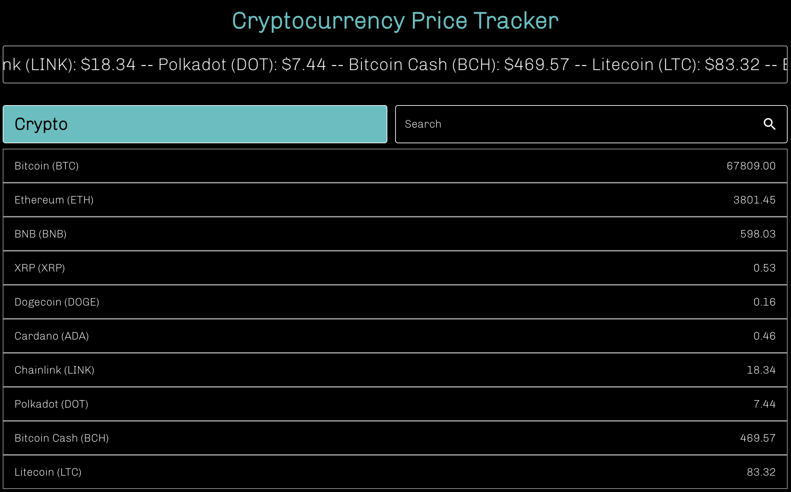
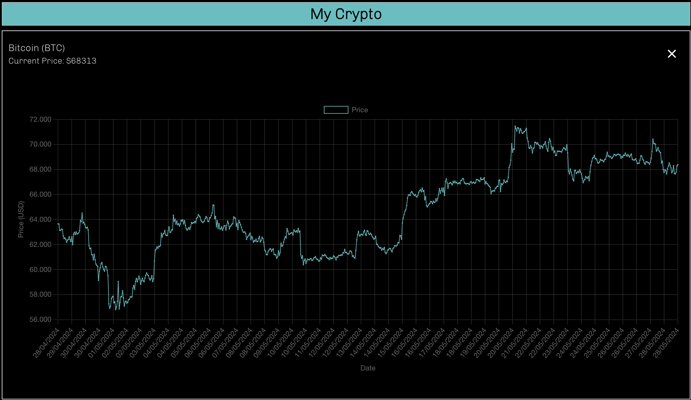
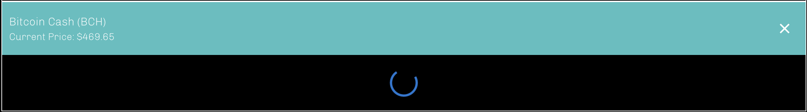

# Crypto Price Tracker

Crypto Price Tracker is a web application built with React and TypeScript that allows you to monitor cryptocurrency prices in real-time and view their historical price data. The application uses Redux for state management and Material-UI for styling.

## Prerequisites

Ensure you have the following tools installed on your system:

- [Node.js](https://nodejs.org/en/)
- [npm](https://www.npmjs.com/) or [yarn](https://yarnpkg.com/)

## Installation

1. Clone the repository:

   ```bash
   git clone https://github.com/mick-s9/crypto-twave-test.git

2. Navigate to the project directory: 
-cd crypto-twave-test

3. Install Dependencies:
-npm install
or
-yarn install (if you use yarn)

4. Run the Application:
-npm start 
or 
-yarn start (if you use yarn)

Open http://localhost:3000 to view the application in the browser.


## Features

- **Real-Time Display**: Shows current prices of major cryptocurrencies.
- **Price History**: Displays historical price charts for selected cryptocurrencies.
- **Search**: Search for cryptocurrencies by name or symbol.
- **Cryptocurrency Selection**: Add and remove cryptocurrencies to your personal watchlist.
- **Automatic Updates**: Data is automatically updated every minute.


## Application Functionality

When the application is opened, a call is made to retrieve the prices of all 10 cryptocurrencies, and this data is saved in the store. There is a slider at the top of the page that shows all the current prices scrolling and updating every minute without needing to reload the page. Every minute, a new call is made to update the prices, so the app does not need to be reloaded.

Here the tex slide and the list of Crypto available with the realtime price of all the cryptos:



If one of the cryptocurrency items is clicked, that item is opened in the "My Crypto" list, which shows all the selected items and displays the price history chart for the last month.



If too many items are opened and clicked one after another, there is a possibility that the application will encounter a 429 Too Many Requests error from the CoinGecko API. In this case, the items will still appear in the "My Crypto" list with the current price visible, but instead of the chart, a loader will be displayed. After a minute, the application will automatically retry the call to fetch the price history for the items that were loading to retrieve the result.



It is possible to show and hide the chart by clicking on the items in the list. Additionally, items can be removed from the list by clicking on the 'x'.


## General Project Description
The application is primarily composed of the following modules:


Main Component (App.tsx):
Contains the main logic for fetching and updating cryptocurrency data.
Uses Redux to manage the global state of the application.
Displays a title and the list of cryptocurrencies via the CryptoList component.


State Management (store/):
Configuration of the Redux store using Redux Toolkit.
Usage of slices to manage the state of cryptocurrencies, including current data and price histories.
Definition of asynchronous thunks to make API calls and fetch cryptocurrency data.

Components (components/):
CryptoList: Component that displays the list of cryptocurrencies and manages the selection of cryptocurrencies to be tracked.
CryptoItem: Component representing a single cryptocurrency in the list.
CryptoChart: Component that shows the historical price chart of a selected cryptocurrency.

Styling (styles/):
Usage of Material-UI for styled components and layout.
CSS files for global and component-specific styles.


## APIs Used
The application uses the CoinGecko API to fetch cryptocurrency data. Specifically, API calls are made to obtain current prices and historical data for cryptocurrencies.

